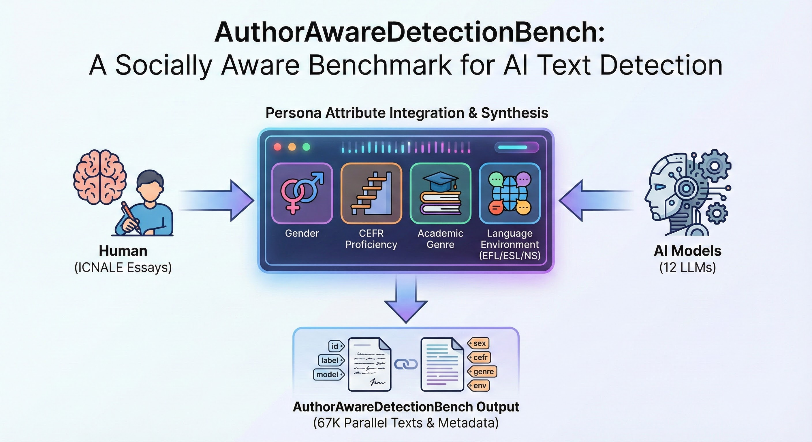

<div align="center">

# Who Writes What: Unveiling the Impact of Author Roles on AI-generated Text Detection [ACL 2025]

<p align="center">
  <a href="https://aclanthology.org/2025.acl-long.1292.pdf">
    
  </a>
  <a href="https://huggingface.co/datasets/leejamesssss/AuthorAwareDetectionBench">
    
  </a>
  <a href="https://github.com/leejamesss/AuthorAwareDetection">
    
  </a>
</p>



</div>


## Overview
**AuthorAwareDetection** is the official repository for the ACL 2025 paper *"[Who Writes What: Unveiling the Impact of Author Roles on AI-generated Text Detection](https://aclanthology.org/2025.acl-long.1292.pdf)"*.

The current AI text detection field largely overlooks the influence of author characteristics. **AuthorAwareDetectionBench** is a benchmark designed to investigate how sociolinguistic attributes, including Gender, CEFR Proficiency, Academic Field, and Language Environment, impact the performance of AI text detectors. 

We employ 12 diverse LLMs to generate parallel texts that mirror the demographic profiles of human authors from the ICNALE corpus, creating a controlled environment for bias analysis.


## Data Access

### 1. AI-Generated Data Only

We host the **AI-generated portion** of the benchmark directly on Hugging Face. You can load it easily via:

```python
from datasets import load_dataset

# Loads only the AI-generated samples
dataset = load_dataset("leejamesssss/AuthorAwareDetectionBench", split="train")
```

### 2. Full Benchmark Reproduction (Human + AI)

Due to the **ICNALE Terms of Use**, we cannot distribute the original human texts. To reproduce the full benchmark, please follow these steps:

#### Step 1: Prepare the Data

1. **Download Human Data:** Obtain the **[ICNALE Written English Corpus](http://language.sakura.ne.jp/icnale/download.html)** (specifically the `WE_0_Unclassified_Unmerged` folder) from the official website. 

2. **Download AI Data:** Download the `ai_generated_dataset.jsonl` from the [Files and versions](https://huggingface.co/datasets/leejamesssss/AuthorAwareDetectionBench/tree/main) tab of this repository.

3. **Clone Our Repository:** Get the processing scripts and metadata:

   ```bash
   git clone https://github.com/leejamesss/AuthorAwareDetection.git
   cd AuthorAwareDetection
   ```

#### Step 2: Merge the Datasets

Use the provided script to align human texts with metadata and merge them with our AI dataset:

```bash
python scripts/merge_data.py \
  --human_input_dir "/path/to/your/ICNALE_WE_2.6/WE_0_Unclassified_Unmerged" \
  --metadata_file "data/metadata/human_metadata.csv" \
  --ai_file "/path/to/downloaded/ai_generated_dataset.jsonl" \
  --output "authoraware_benchmark.jsonl"
```

> **Note:** The `human_metadata.csv` is included in our GitHub repository. Ensure you point to the correct paths for your downloaded files.


## License

This dataset is licensed under **CC BY-NC 4.0** (AI text & metadata) and **MIT** (Code).

> **Note:** Consistent with the [ICNALE Terms of Use](http://language.sakura.ne.jp/icnale/), this repository does not distribute original human-authored texts. Researchers must obtain the ICNALE corpus separately to reproduce the full benchmark.


## Citation

If you use this dataset in your research, please cite our paper:

```bibtex
@misc{li2025writeswhatunveilingimpact,
      title={Who Writes What: Unveiling the Impact of Author Roles on AI-generated Text Detection},
      author={Jiatao Li and Xiaojun Wan},
      year={2025},
      eprint={2502.12611},
      archivePrefix={arXiv},
      primaryClass={cs.CL},
      url={https://arxiv.org/abs/2502.12611},
}
```

Please also credit the original ICNALE corpus:

```
@article{ishikawa2013icnale,
  author = {Ishikawa, Shin'ichiro},
  title = {The ICNALE and sophisticated contrastive interlanguage analysis of Asian learners of English},
  journal = {Learner corpus studies in Asia and the world},
  volume = {1},
  year = {2013},
  pages = {91-118}
}
```


